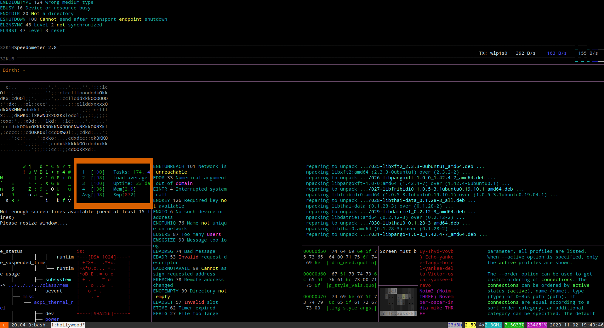

# bash
*bash tools and stuff*
&nbsp;    
&nbsp;     
&nbsp;  
&nbsp;  


### **grep for multiple phrases**
```bash
$ ls | grep 'phrase1\|phrase2' 
```
&nbsp;  
&nbsp;   
### **bash encryption tool**
```bash
$ sudo apt -y install mcrypt
$ nano test_file.txt #create test file
```


&nbsp;&nbsp;&nbsp;&nbsp; *GNU nano &nbsp;test_mcrypt.txt*
```bash
encrypt this file with mcrypt

testing...

42
 42
  42
   42
  42
 42
42
```
```bash
$ nano key.txt #create key
```
&nbsp;&nbsp;&nbsp;&nbsp; *GNU nano &nbsp;key.txt*
```bash
greatPassword42!
```
```bash
$ mcrypt test_mcrypt.txt --keyfile key.txt # encrypt file 
$ rm test_mcrypt.txt # remove original
$ ls
key.txt  README.md  test_mcrypt.txt.nc
$ mcrypt --decrypt text_mcrypt.txt.nc --keyfile key.txt
$ ls
key.txt  README.md  test_mcrypt.txt.nc  test_mcrypt.txt  
```
&nbsp;   
&nbsp;  
### **Look pro**
```console
$ sudo apt -y install hollywood
$ hollywood
```
&nbsp;&nbsp;&nbsp;&nbsp; *Hollywood Screenshot*

&nbsp;  
&nbsp;   
### **Internet speed test CLI**
*After cloning this bash repo...*
```sh
$ ./install_speed.sh
$ speedtest
```
&nbsp;  
&nbsp;   
### **next bash tool**
```console
$ [insert next bash tool] # placeholder
$ echo This is md-console
This code section is md-console 

    ```console
    $
    ```

$ echo Not md-bash
Not md-bash 

    ```bash
    $ 
    ```

$ 
```

&nbsp;  
&nbsp;  
&nbsp;  
&nbsp;  
&nbsp;     
*\*This repo may end up merging with OS repo\**


